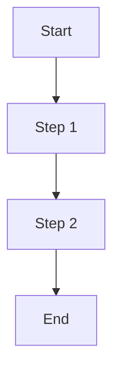

# 📚 Documentation Contributing Guide

**Version:** 1.0  
**Last Updated:** November 16, 2025  
**Maintained By:** Documentation Team

---

## 🎯 Purpose

This guide helps contributors maintain and improve the Parenting AI documentation. Whether you're adding new features, fixing bugs, or updating existing docs, follow these standards to keep our documentation high-quality and consistent.

---

## 📋 Table of Contents

1. [Quick Start](#quick-start)
2. [Documentation Structure](#documentation-structure)
3. [When to Add Documentation](#when-to-add-documentation)
4. [Where to Add Documentation](#where-to-add-documentation)
5. [Naming Conventions](#naming-conventions)
6. [Document Templates](#document-templates)
7. [Writing Style Guide](#writing-style-guide)
8. [Code Examples](#code-examples)
9. [Update vs Create Policy](#update-vs-create-policy)
10. [Archive Policy](#archive-policy)
11. [Review Process](#review-process)
12. [Tools and Resources](#tools-and-resources)

---

## 🚀 Quick Start

### For New Contributors

**Before making documentation changes:**

1. **Read existing docs:**
   - Start with `/docs/README.md`
   - Review `/docs/DOCUMENTATION_MAP.md` for structure
   - Check `/docs/DOCUMENTATION_COVERAGE_ANALYSIS.md` for gaps

2. **Find the right location:**
   - Feature docs → `/docs/04-features/`
   - Implementation logs → `/docs/05-implementation/`
   - Setup guides → `/docs/02-setup/`
   - Testing → `/docs/06-testing/`

3. **Follow the template:**
   - Use appropriate template (see [Document Templates](#document-templates))
   - Include all required sections
   - Add metadata (Status, Priority, Last Updated, Related Docs)

4. **Test your changes:**
   - Verify all links work
   - Check code examples compile
   - Ensure markdown renders correctly

---

## 📁 Documentation Structure

### Current Organization (9 Folders)

```
docs/
├── 01-planning/           ← Project planning (historical)
├── 02-setup/              ← Setup and configuration guides
├── 03-architecture/       ← System architecture and design
├── 04-features/           ← Feature specifications
├── 05-implementation/     ← Implementation logs
├── 06-testing/            ← Testing documentation
├── 07-reference/          ← API references and guides
├── 08-maintenance/        ← Troubleshooting and maintenance
├── 09-roadmap/            ← Future plans and backlog
└── _archive/              ← Historical documentation
```

**See:** `/docs/DOCUMENTATION_MAP.md` for complete structure

---

## 🤔 When to Add Documentation

### Always Document

**Feature Implementation:**
- ✅ New features (user-facing or internal)
- ✅ Significant bug fixes affecting multiple users
- ✅ API changes or new endpoints
- ✅ Database schema changes
- ✅ Configuration changes
- ✅ Breaking changes

**Setup & Configuration:**
- ✅ New third-party integrations (RevenueCat, AdMob, etc.)
- ✅ Environment variable changes
- ✅ Deployment procedure updates
- ✅ New dependencies

**Architecture:**
- ✅ System design decisions
- ✅ Data flow changes
- ✅ Performance optimizations
- ✅ Security improvements

---

### Optional Documentation

**Minor Changes:**
- 🟡 Small UI tweaks (update existing docs)
- 🟡 Refactoring without behavior change
- 🟡 Dependency version updates (note in changelog)

---

### Don't Document

**Trivial Changes:**
- ❌ Typo fixes in code
- ❌ Code formatting
- ❌ Comment updates only
- ❌ Development-only scripts

---

## 📍 Where to Add Documentation

### By Document Type

| Type | Location | Example |
|------|----------|---------|
| **Feature Specification** | `/docs/04-features/` | `chat-ai.md`, `authentication.md` |
| **Implementation Log** | `/docs/05-implementation/completed/` | `growth-tracker.md`, `data-sync.md` |
| **Setup Guide** | `/docs/02-setup/` | `google-oauth.md`, `revenuecat.md` |
| **Testing Guide** | `/docs/06-testing/` | `manual-testing.md` (update existing) |
| **API Reference** | `/docs/07-reference/` | `api-reference.md`, `components.md` |
| **Troubleshooting** | `/docs/08-maintenance/` | `troubleshooting.md` (update existing) |
| **Roadmap** | `/docs/09-roadmap/` | `next-features.md`, `backlog.md` |

---

### Special Cases

**UI Components:**
→ `/docs/05-implementation/completed/ui/`  
Example: `dashboard.md`, `header.md`

**AI/Personalization:**
→ `/docs/05-implementation/completed/personalization/`  
Example: `AI_PERSONA_MASCOT_ICONS.md`

**Monetization:**
→ `/docs/04-features/monetization/`  
Example: `subscriptions.md`, `ads.md`

**Deployment:**
→ `/docs/02-setup/deployment/`  
Example: `app-store.md`, `play-store.md`

---

## 📝 Naming Conventions

### File Names

**Use kebab-case:**
- ✅ `chat-ai.md`
- ✅ `growth-tracker.md`
- ✅ `google-oauth.md`
- ❌ `ChatAI.md`
- ❌ `growth_tracker.md`
- ❌ `googleOAuth.md`

**Be descriptive:**
- ✅ `authentication.md` (clear)
- ✅ `push-notifications.md` (specific)
- ❌ `auth.md` (too short)
- ❌ `notifications.md` (ambiguous)

**Use consistent prefixes:**
- Setup guides: No prefix (e.g., `supabase-setup.md`)
- Implementation logs: Feature name (e.g., `growth-tracker.md`)
- Testing: Test type (e.g., `manual-testing.md`)

---

### Folder Names

**Use descriptive names:**
- ✅ `/monetization/` (clear category)
- ✅ `/deployment/` (specific purpose)
- ✅ `/personalization/` (descriptive)
- ❌ `/misc/` (too vague)
- ❌ `/temp/` (use `_archive/` instead)

---

## 📄 Document Templates

### Feature Specification Template

```markdown
# [Feature Name]

**Last Updated:** [Date]  
**Status:** [✅ Complete / 🚧 In Progress / 📋 Planned]  
**Priority:** [HIGH / MEDIUM / LOW]

**Related Documentation:**
- Implementation: `/docs/05-implementation/completed/[file].md`
- Testing: `/docs/06-testing/manual-testing.md` ([Feature] section)
- API Reference: `/docs/07-reference/api-reference.md`

---

## 📋 Table of Contents

1. [Overview](#overview)
2. [User Stories](#user-stories)
3. [User Flow](#user-flow)
4. [Technical Specifications](#technical-specifications)
5. [API Endpoints](#api-endpoints)
6. [Database Schema](#database-schema)
7. [UI Components](#ui-components)
8. [Testing](#testing)
9. [Known Issues](#known-issues)
10. [Future Enhancements](#future-enhancements)

---

## 📊 Overview

[Brief description of the feature, its purpose, and value to users]

**Key Features:**
- ✅ Feature 1
- ✅ Feature 2
- ✅ Feature 3

---

## 👤 User Stories

**As a [user type], I want to [goal] so that [benefit].**

Example:
- As a parent, I want to track my baby's growth so that I can monitor development milestones.

---

## 🔄 User Flow

1. Step 1: [Description]
2. Step 2: [Description]
3. Step 3: [Description]

**Diagram:** (Add Mermaid diagram if helpful)

---

## 🏗️ Technical Specifications

### Architecture

[Architecture description]

### Dependencies

- Dependency 1
- Dependency 2

### Configuration

```typescript
// Configuration example
```

---

## 📡 API Endpoints

### Endpoint Name

**Method:** `POST`  
**URL:** `/api/endpoint`

**Request:**
```json
{
  "field": "value"
}
```

**Response:**
```json
{
  "success": true,
  "data": {}
}
```

---

## 💾 Database Schema

```sql
CREATE TABLE table_name (
  id UUID PRIMARY KEY,
  field TEXT
);
```

---

## 🎨 UI Components

### Component Name

**Location:** `src/components/ComponentName.tsx`

**Props:**
```typescript
interface Props {
  prop1: string;
  prop2: number;
}
```

**Usage:**
```tsx
<ComponentName prop1="value" prop2={123} />
```

---

## ✅ Testing

### Manual Testing

- [ ] Test case 1
- [ ] Test case 2

### Automated Tests

```bash
npm test -- featureName.test.ts
```

---

## 🐛 Known Issues

- Issue 1: Description and workaround

---

## 💡 Future Enhancements

- Enhancement 1
- Enhancement 2

---

**Last Updated:** [Date]  
**Maintained By:** [Team/Person]
```

---

### Implementation Log Template

```markdown
# [Feature Name] Implementation

**Last Updated:** [Date]  
**Status:** ✅ Complete  
**Priority:** [HIGH / MEDIUM / LOW]  
**Implementation Period:** [Date range]  
**Total Code:** [X lines]

**Related Documentation:**
- Feature Spec: `/docs/04-features/[file].md`
- Testing: `/docs/06-testing/manual-testing.md`
- API Reference: `/docs/07-reference/api-reference.md`

---

## 📋 Table of Contents

1. [Overview](#overview)
2. [Problem Statement](#problem-statement)
3. [Solution](#solution)
4. [Technical Implementation](#technical-implementation)
5. [Code Changes](#code-changes)
6. [Testing](#testing)
7. [Deployment](#deployment)
8. [Performance Impact](#performance-impact)
9. [Known Issues](#known-issues)
10. [Future Improvements](#future-improvements)

---

## 📊 Overview

[Brief description of what was implemented]

**Goals:**
- ✅ Goal 1
- ✅ Goal 2

---

## 🔴 Problem Statement

[Description of the problem or need that led to this implementation]

---

## 💡 Solution

[Description of the solution approach]

---

## 🏗️ Technical Implementation

### Architecture

[Architecture description with code examples]

### Files Changed

- `path/to/file1.ts` (123 lines)
- `path/to/file2.tsx` (456 lines)

---

## 💻 Code Changes

### File: `path/to/file.ts`

**Before:**
```typescript
// Old code
```

**After:**
```typescript
// New code
```

---

## ✅ Testing

### Unit Tests

```bash
npm test -- file.test.ts
```

### Manual Testing

- [x] Test case 1 - PASS
- [x] Test case 2 - PASS

---

## 🚀 Deployment

**Steps:**
1. Step 1
2. Step 2

**Environment Variables:**
```bash
VARIABLE_NAME=value
```

---

## 📈 Performance Impact

**Metrics:**
- Before: [metric]
- After: [metric]
- Improvement: [percentage]

---

## 🐛 Known Issues

- Issue 1: [Description and workaround]

---

## 💡 Future Improvements

- Improvement 1
- Improvement 2

---

**Last Updated:** [Date]  
**Maintained By:** [Team/Person]
```

---

### Setup Guide Template

```markdown
# [Service/Tool] Setup Guide

**Last Updated:** [Date]  
**Status:** ✅ Production Ready  
**Estimated Time:** [X minutes/hours]

**Related Documentation:**
- Feature: `/docs/04-features/[file].md`
- Implementation: `/docs/05-implementation/completed/[file].md`
- Troubleshooting: `/docs/08-maintenance/troubleshooting.md`

---

## 📋 Prerequisites

- Requirement 1
- Requirement 2

---

## 🚀 Quick Start

### Step 1: [Action]

[Description and code/commands]

### Step 2: [Action]

[Description and code/commands]

---

## 🔧 Configuration

### Environment Variables

```bash
VARIABLE_NAME=value
```

### Config Files

**File:** `path/to/config.json`
```json
{
  "setting": "value"
}
```

---

## ✅ Verification

**Test that setup worked:**

```bash
# Command to verify
```

**Expected Output:**
```
Success message
```

---

## 🐛 Troubleshooting

### Issue 1: [Problem]

**Solution:** [Fix]

---

**Last Updated:** [Date]  
**Maintained By:** [Team/Person]
```

---

## ✍️ Writing Style Guide

### Tone & Voice

**DO:**
- ✅ Be clear and concise
- ✅ Use active voice ("Click the button" not "The button should be clicked")
- ✅ Be friendly but professional
- ✅ Use examples liberally
- ✅ Explain "why" not just "how"

**DON'T:**
- ❌ Use jargon without explanation
- ❌ Assume knowledge level
- ❌ Be overly casual or informal
- ❌ Use ambiguous terms ("soon", "recently")

---

### Formatting

**Headings:**
```markdown
# Title (H1) - One per document
## Section (H2) - Main sections
### Subsection (H3) - Under H2
```

**Lists:**
```markdown
- Unordered list for non-sequential items
1. Ordered list for step-by-step instructions
```

**Emphasis:**
```markdown
**Bold** for UI elements, file names, important terms
*Italic* for emphasis (use sparingly)
`Code` for code, variables, file paths
```

**Code Blocks:**
````markdown
```typescript
// Always specify language
const example = "code";
```
````

**Links:**
```markdown
[Link Text](./relative/path.md) for internal links
[External Link](https://example.com) for external
```

---

### Status Emojis

Use consistent status emojis:

- ✅ Complete, Production-ready, Pass
- 🚧 In Progress, Partial
- 📋 Planned, Todo
- ❌ Missing, Fail, Not Implemented
- ⚠️ Warning, Deprecated
- 🔴 Critical, Error
- 🟡 Medium Priority
- 🟢 Low Priority
- 🏆 Achievement, Best
- ⭐ Featured, Important

---

## 💻 Code Examples

### Requirements

**All code examples MUST:**
1. ✅ Be tested and working
2. ✅ Include comments explaining key parts
3. ✅ Specify the language for syntax highlighting
4. ✅ Include file paths when relevant
5. ✅ Be complete (no `...` unless necessary)

---

### TypeScript Example

```typescript
/**
 * Good example: Clear, commented, complete
 * File: src/services/exampleService.ts
 */
interface Example {
  id: string;
  name: string;
}

export const getExample = async (id: string): Promise<Example> => {
  // Fetch from Supabase
  const { data, error } = await supabase
    .from('examples')
    .select('*')
    .eq('id', id)
    .single();
    
  if (error) throw error;
  return data;
};
```

---

### React Component Example

```tsx
/**
 * Good example: Props typed, commented, complete
 * File: src/components/ExampleComponent.tsx
 */
import React from 'react';
import { View, Text } from 'react-native';

interface Props {
  title: string;
  onPress: () => void;
}

export const ExampleComponent: React.FC<Props> = ({ title, onPress }) => {
  return (
    <View>
      <Text onPress={onPress}>{title}</Text>
    </View>
  );
};
```

---

### Command Example

```bash
# Always explain what the command does
npm install package-name

# Show expected output if helpful
# Output: ✓ Installed successfully
```

---

## 🔄 Update vs Create Policy

### When to Update Existing Docs

**Update when:**
- ✅ Adding to existing feature
- ✅ Fixing errors or clarifications
- ✅ Updating outdated information
- ✅ Adding examples to existing sections

**How to update:**
1. Read the entire document first
2. Update the "Last Updated" date
3. Update the relevant sections
4. Keep the overall structure
5. Note major changes in a changelog (if applicable)

---

### When to Create New Docs

**Create new when:**
- ✅ Documenting new feature (no existing doc)
- ✅ Creating specialized guide
- ✅ Major refactoring changes entire approach
- ✅ Splitting overly long doc (>1000 lines)

**How to create new:**
1. Choose appropriate template
2. Pick correct location (see [Where to Add Documentation](#where-to-add-documentation))
3. Use consistent naming
4. Link to/from related docs
5. Update parent README.md

---

## 📦 Archive Policy

### When to Archive

**Archive when:**
- ✅ Document is outdated and replaced
- ✅ Feature was removed or deprecated
- ✅ Implementation was superseded
- ✅ Content consolidated into comprehensive doc

**DO NOT archive:**
- ❌ Documents that are still referenced
- ❌ Historical context that explains decisions
- ❌ Troubleshooting for issues users might still hit

---

### How to Archive

**Step 1: Choose Archive Location**

Based on original location:
- `04-features/` → `_archive/old-features/`
- `05-implementation/` → `_archive/old-implementations/`
- `02-setup/` → `_archive/old-setup/`
- `06-testing/` → `_archive/old-testing/`
- `08-maintenance/` → `_archive/old-troubleshooting/`

**Step 2: Move File**

```bash
# Move to archive
mv docs/04-features/old-feature.md docs/_archive/old-features/

# Update archive README
# Add entry to /docs/_archive/README.md
```

**Step 3: Update Links**

- Update any docs that reference the archived file
- Add redirect note in original location if needed
- Update parent folder README.md

**Step 4: Document in Archive**

Add entry to `/docs/_archive/README.md`:

```markdown
### old-feature.md
- **Original Location:** `/docs/04-features/`
- **Archived:** November 16, 2025
- **Reason:** Replaced by comprehensive-feature.md
- **Consolidated Into:** `/docs/04-features/comprehensive-feature.md`
```

---

## 👥 Review Process

### Self-Review Checklist

Before submitting documentation:

- [ ] Spell-checked and grammar-checked
- [ ] All links work (internal and external)
- [ ] Code examples tested and work
- [ ] Markdown renders correctly
- [ ] Metadata complete (Status, Priority, Last Updated, Related Docs)
- [ ] Follows template structure
- [ ] Consistent with existing docs
- [ ] Related docs updated (READMEs, links)

---

### Peer Review

**Reviewers check:**
- [ ] Accuracy of technical content
- [ ] Clarity for target audience
- [ ] Consistency with style guide
- [ ] Completeness (no missing sections)
- [ ] Links and references work
- [ ] Code examples are correct

---

### Approval Process

1. **Self-review:** Author checks all items
2. **Peer review:** Team member reviews
3. **Final check:** Documentation maintainer approves
4. **Merge:** Documentation committed to main branch

---

## 🛠️ Tools and Resources

### Markdown Editors

**Recommended:**
- VS Code with Markdown Preview
- Typora (WYSIWYG markdown editor)
- MacDown (macOS)

---

### Markdown Linting

**Use markdownlint:**
```bash
npm install -g markdownlint-cli
markdownlint docs/**/*.md
```

---

### Link Checking

**Check all links:**
```bash
# Internal links
grep -r "\[.*\](\./" docs/

# External links (verify manually)
grep -r "https://" docs/
```

---

### Mermaid Diagrams

**Create flowcharts and diagrams:**



**Learn more:** https://mermaid.js.org/

---

## 📞 Getting Help

**Questions about documentation?**

1. Check `/docs/DOCUMENTATION_MAP.md` for navigation
2. Review existing similar docs
3. Ask in team chat: #documentation
4. Contact documentation maintainer

**Found an error?**
1. Submit issue: GitHub Issues
2. Or fix it directly (follow this guide!)

---

## 📈 Documentation Metrics

**We track:**
- Documentation coverage (% features documented)
- Doc freshness (last updated dates)
- Link health (broken links)
- User feedback (was this helpful?)

**Current Status:**
- Coverage: 78% (Production Ready)
- Freshness: 100% updated in last 2 months
- Link Health: 0 broken links
- User Rating: N/A (new system)

---

## 🎯 Documentation Goals

**Short-term (Q4 2025):**
- [ ] Achieve 90% documentation coverage
- [ ] Document all HIGH priority features
- [ ] Create video tutorials for setup
- [ ] Add contribution templates to repo

**Long-term (2026):**
- [ ] Interactive documentation (runnable examples)
- [ ] Community contributions
- [ ] Multi-language docs (ID, EN)
- [ ] Automated doc generation from code

---

## 📚 Additional Resources

**Internal:**
- Documentation Map: `/docs/DOCUMENTATION_MAP.md`
- Coverage Analysis: `/docs/DOCUMENTATION_COVERAGE_ANALYSIS.md`
- Quick Reference: `/docs/QUICK_REFERENCE_CARDS.md`
- Archive Catalog: `/docs/_archive/README.md`

**External:**
- [GitHub Markdown Guide](https://guides.github.com/features/mastering-markdown/)
- [Google Developer Documentation Style Guide](https://developers.google.com/style)
- [Microsoft Writing Style Guide](https://docs.microsoft.com/en-us/style-guide/welcome/)
- [Write the Docs](https://www.writethedocs.org/)

---

## ✅ Quick Reference

### Common Tasks

**Add new feature documentation:**
1. Create `/docs/04-features/feature-name.md`
2. Use Feature Specification Template
3. Add metadata
4. Update `/docs/04-features/README.md`
5. Link from `/docs/README.md` if major

**Document implementation:**
1. Create `/docs/05-implementation/completed/feature-name.md`
2. Use Implementation Log Template
3. Link to feature spec
4. Update `/docs/05-implementation/README.md`

**Update setup guide:**
1. Edit existing file in `/docs/02-setup/`
2. Update "Last Updated" date
3. Test all commands/steps
4. Verify links work

**Archive old doc:**
1. Move to appropriate `_archive/` subfolder
2. Update `_archive/README.md`
3. Update links in other docs
4. Update parent folder README

---

**Thank you for contributing to Parenting AI documentation!** 🎉

---

**Last Updated:** November 16, 2025  
**Version:** 1.0  
**Maintained By:** Documentation Team  
**Questions?** Open an issue or ask in #documentation
